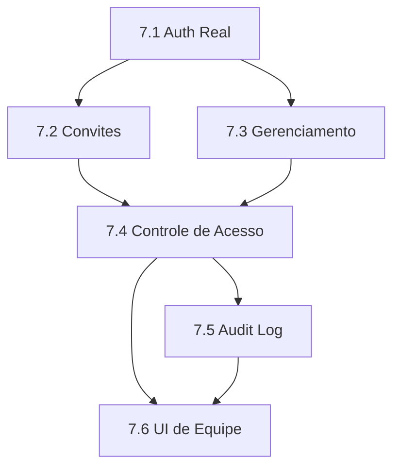

# 👥 Épico 07: Multi-Usuários & Roles

## Objetivo

Implementar sistema completo de multi-usuários com controle de acesso baseado em roles, permitindo que equipes colaborem de forma segura dentro de cada organização.

## Problema de Negócio

Atualmente o sistema usa mock auth com um único usuário fixo:
- ❌ Impossível ter múltiplos membros na equipe
- ❌ Sem controle de quem fez o quê
- ❌ Sem auditoria de ações
- ❌ Sem diferenciação de permissões

## Solução

Sistema completo de autenticação real + convites por link público + roles (OWNER/ADMIN/MEMBER) + audit log.

---

## Features

### ✅ Feature 7.1: Autenticação Real com Supabase
**Status:** 🔴 TODO  
**Prioridade:** P0  
**Estimativa:** 8 pontos

**Descrição:**
Substituir mock auth por Supabase Auth real com email/password.

**Critérios de Aceite:**
- [ ] Login funcional com email/password
- [ ] Signup cria organização e UserProfile automaticamente
- [ ] Middleware protege rotas autenticadas
- [ ] Callback handler para confirmação de email
- [ ] Mock auth completamente removido

**Tarefas Técnicas:**

| ID | Tarefa | Arquivo | Estimativa |
|----|--------|---------|------------|
| 7.1.1 | Modificar página de login para usar Supabase Auth real | `src/app/login/page.tsx` | 2h |
| 7.1.2 | Criar página de signup com criação automática de org | `src/app/signup/page.tsx` | 3h |
| 7.1.3 | Criar auth callback handler | `src/app/auth/callback/route.ts` | 1h |
| 7.1.4 | Configurar middleware de proteção de rotas | `src/middleware.ts` | 2h |
| 7.1.5 | Remover DEV_MOCK_AUTH e mock user IDs | `src/shared/http/auth.helpers.ts` | 1h |
| 7.1.6 | Criar hook useAuth para client-side | `src/hooks/use-auth.ts` | 2h |
| 7.1.7 | Adicionar Logout funcional no header | `src/components/layout/user-menu.tsx` | 1h |

---

### ✅ Feature 7.2: Sistema de Convites por Link Público
**Status:** 🔴 TODO  
**Prioridade:** P0  
**Estimativa:** 8 pontos

**Descrição:**
Permitir que OWNER/ADMIN gerem links de convite públicos para novos membros entrarem na organização.

**Critérios de Aceite:**
- [ ] OWNER/ADMIN pode gerar link de convite com role pré-definido
- [ ] Link expira após 7 dias (configurável)
- [ ] Qualquer pessoa com link válido pode criar conta e entrar na org
- [ ] Convites podem ser revogados antes de serem aceitos
- [ ] Lista de convites pendentes visível para OWNER/ADMIN

**Tarefas Técnicas:**

| ID | Tarefa | Arquivo | Estimativa |
|----|--------|---------|------------|
| 7.2.1 | Adicionar model Invite no schema Prisma | `prisma/schema.prisma` | 1h |
| 7.2.2 | Criar migration para tabela invites | `prisma/migrations/` | 30min |
| 7.2.3 | Implementar InviteRepository com CRUD | `src/infra/adapters/prisma/invite.repository.ts` | 2h |
| 7.2.4 | Criar use case CreateInvite | `src/domain/use-cases/invites/create-invite.ts` | 1h |
| 7.2.5 | Criar use case AcceptInvite | `src/domain/use-cases/invites/accept-invite.ts` | 2h |
| 7.2.6 | Criar use case RevokeInvite | `src/domain/use-cases/invites/revoke-invite.ts` | 1h |
| 7.2.7 | Implementar POST /api/invites (criar) | `src/app/api/invites/route.ts` | 1h |
| 7.2.8 | Implementar GET /api/invites (listar) | `src/app/api/invites/route.ts` | 30min |
| 7.2.9 | Implementar GET /api/invites/[token] (validar) | `src/app/api/invites/[token]/route.ts` | 1h |
| 7.2.10 | Implementar DELETE /api/invites/[token] (revogar) | `src/app/api/invites/[token]/route.ts` | 30min |
| 7.2.11 | Criar página pública de aceitar convite | `src/app/invite/[token]/page.tsx` | 2h |

---

### ✅ Feature 7.3: Gerenciamento de Membros da Organização
**Status:** 🔴 TODO  
**Prioridade:** P0  
**Estimativa:** 5 pontos

**Descrição:**
Permitir que OWNER gerencie roles dos membros e que qualquer usuário possa sair da organização.

**Critérios de Aceite:**
- [ ] OWNER pode alterar role de qualquer membro (exceto a si mesmo)
- [ ] OWNER/ADMIN pode remover membros (ADMIN não pode remover OWNER)
- [ ] Qualquer usuário pode sair da organização voluntariamente
- [ ] Último OWNER não pode sair sem transferir ownership
- [ ] Estrutura preparada para limite de usuários por org (não ativo ainda)

**Tarefas Técnicas:**

| ID | Tarefa | Arquivo | Estimativa |
|----|--------|---------|------------|
| 7.3.1 | Adicionar updateRole no UserProfileRepository | `src/infra/adapters/prisma/user-profile.repository.ts` | 1h |
| 7.3.2 | Adicionar delete no UserProfileRepository | `src/infra/adapters/prisma/user-profile.repository.ts` | 1h |
| 7.3.3 | Criar use case ChangeUserRole | `src/domain/use-cases/users/change-user-role.ts` | 1h |
| 7.3.4 | Criar use case RemoveUserFromOrg | `src/domain/use-cases/users/remove-user-from-org.ts` | 1h |
| 7.3.5 | Criar use case LeaveOrganization | `src/domain/use-cases/users/leave-organization.ts` | 1h |
| 7.3.6 | Implementar PATCH /api/users/[id]/role | `src/app/api/users/[id]/role/route.ts` | 1h |
| 7.3.7 | Implementar DELETE /api/users/[id] | `src/app/api/users/[id]/route.ts` | 1h |
| 7.3.8 | Implementar POST /api/users/me/leave | `src/app/api/users/me/leave/route.ts` | 1h |
| 7.3.9 | Adicionar campo maxUsers em Organization (preparação) | `prisma/schema.prisma` | 30min |

---

### ✅ Feature 7.4: Controle de Acesso Baseado em Roles
**Status:** 🔴 TODO  
**Prioridade:** P0  
**Estimativa:** 5 pontos

**Descrição:**
Implementar verificação de permissões em todas as rotas protegidas baseado na matriz de roles.

**Matriz de Permissões:**

| Ação | OWNER | ADMIN | MEMBER |
|------|-------|-------|--------|
| Gerenciar organização | ✅ | ❌ | ❌ |
| Gerar convites | ✅ | ✅ | ❌ |
| Remover usuários | ✅ | ✅* | ❌ |
| Alterar roles | ✅ | ❌ | ❌ |
| CRUD Projetos | ✅ | ✅ | ❌ |
| CRUD Epics/Features/Tasks | ✅ | ✅ | ✅ |

*ADMIN não pode remover OWNER

**Critérios de Aceite:**
- [ ] Helper de permissões reutilizável
- [ ] Todas as rotas protegidas verificam role
- [ ] Erros de permissão retornam 403 com mensagem clara
- [ ] Frontend esconde ações não permitidas

**Tarefas Técnicas:**

| ID | Tarefa | Arquivo | Estimativa |
|----|--------|---------|------------|
| 7.4.1 | Criar permission helper com mapeamento de ações | `src/shared/http/permissions.ts` | 2h |
| 7.4.2 | Adicionar verificação em POST /api/projects | `src/app/api/projects/route.ts` | 30min |
| 7.4.3 | Adicionar verificação em DELETE /api/projects/[id] | `src/app/api/projects/[id]/route.ts` | 30min |
| 7.4.4 | Adicionar verificação em rotas de convites | `src/app/api/invites/route.ts` | 30min |
| 7.4.5 | Adicionar verificação em rotas de users | `src/app/api/users/[id]/route.ts` | 30min |
| 7.4.6 | Criar hook usePermissions para frontend | `src/hooks/use-permissions.ts` | 1h |
| 7.4.7 | Testes unitários para permissions.ts | `src/shared/http/permissions.spec.ts` | 2h |

---

### ✅ Feature 7.5: Audit Log
**Status:** 🔴 TODO  
**Prioridade:** P1  
**Estimativa:** 5 pontos

**Descrição:**
Registrar todas as ações sensíveis do sistema para auditoria e histórico.

**Eventos a Registrar:**
- Usuário entrou na organização (via convite)
- Usuário saiu da organização
- Role alterado
- Usuário removido
- Convite criado/revogado
- Projeto criado/deletado

**Critérios de Aceite:**
- [ ] Model AuditLog no banco com campos: action, userId, targetId, metadata, timestamp
- [ ] Todas as ações sensíveis registradas automaticamente
- [ ] API para consultar logs (OWNER only)
- [ ] Logs não podem ser deletados

**Tarefas Técnicas:**

| ID | Tarefa | Arquivo | Estimativa |
|----|--------|---------|------------|
| 7.5.1 | Adicionar model AuditLog no schema Prisma | `prisma/schema.prisma` | 30min |
| 7.5.2 | Criar migration para tabela audit_logs | `prisma/migrations/` | 30min |
| 7.5.3 | Implementar AuditLogRepository | `src/infra/adapters/prisma/audit-log.repository.ts` | 1h |
| 7.5.4 | Criar service AuditService com método log() | `src/domain/services/audit.service.ts` | 1h |
| 7.5.5 | Integrar audit em use cases de convites | `src/domain/use-cases/invites/*.ts` | 1h |
| 7.5.6 | Integrar audit em use cases de users | `src/domain/use-cases/users/*.ts` | 1h |
| 7.5.7 | Implementar GET /api/audit-logs | `src/app/api/audit-logs/route.ts` | 1h |
| 7.5.8 | Criar página de visualização de logs | `src/app/(dashboard)/settings/audit/page.tsx` | 2h |

---

### ✅ Feature 7.6: UI de Gerenciamento de Equipe
**Status:** 🔴 TODO  
**Prioridade:** P1  
**Estimativa:** 5 pontos

**Descrição:**
Interface para administradores gerenciarem membros, convites e visualizar audit logs.

**Critérios de Aceite:**
- [ ] Página Settings > Team com lista de membros
- [ ] Badge visual para cada role
- [ ] Botão de gerar convite (para OWNER/ADMIN)
- [ ] Ações de alterar role e remover (baseado em permissões)
- [ ] Hook useCurrentUser para dados do usuário logado

**Tarefas Técnicas:**

| ID | Tarefa | Arquivo | Estimativa |
|----|--------|---------|------------|
| 7.6.1 | Criar página Settings > Team | `src/app/(dashboard)/settings/team/page.tsx` | 3h |
| 7.6.2 | Criar componente TeamMemberCard | `src/components/features/settings/team-member-card.tsx` | 1h |
| 7.6.3 | Criar componente InviteDialog | `src/components/features/settings/invite-dialog.tsx` | 2h |
| 7.6.4 | Criar componente UserRoleBadge | `src/components/features/shared/user-role-badge.tsx` | 30min |
| 7.6.5 | Criar componente ChangeRoleDialog | `src/components/features/settings/change-role-dialog.tsx` | 1h |
| 7.6.6 | Criar hook useCurrentUser | `src/hooks/use-current-user.ts` | 1h |
| 7.6.7 | Criar hook useTeamMembers | `src/lib/query/hooks/use-team-members.ts` | 1h |
| 7.6.8 | Criar hook useInvites | `src/lib/query/hooks/use-invites.ts` | 1h |

---

## Dependências

**Bloqueia:**
- Qualquer feature que precise de autenticação real
- Colaboração em tempo real

**Depende de:**
- Épico 01 (infra base do Supabase) - parcialmente já feito

---

## Riscos

| Risco | Probabilidade | Impacto | Mitigação |
|-------|---------------|---------|-----------|
| Complexidade do fluxo de convite | Média | Médio | Testes E2E do fluxo completo |
| Performance do audit log em escala | Baixa | Médio | Índices adequados + paginação |
| UX confusa para roles | Média | Alto | Tooltips e documentação clara |

---

## Métricas de Sucesso

- [ ] Usuário consegue criar conta e entrar em org via link
- [ ] OWNER consegue gerenciar toda a equipe
- [ ] Todas as ações sensíveis registradas no audit log
- [ ] Zero acessos não autorizados (verificar com testes)
- [ ] Tempo de resposta das APIs < 200ms

---

## Estimativa Total

| Feature | Pontos | Prioridade |
|---------|--------|------------|
| 7.1 Autenticação Real | 8 | P0 |
| 7.2 Sistema de Convites | 8 | P0 |
| 7.3 Gerenciamento de Membros | 5 | P0 |
| 7.4 Controle de Acesso | 5 | P0 |
| 7.5 Audit Log | 5 | P1 |
| 7.6 UI de Equipe | 5 | P1 |
| **Total** | **36** | - |

---

## Ordem de Execução Recomendada

1. **Sprint 1:** Features 7.1 + 7.2 (16 pontos)
2. **Sprint 2:** Features 7.3 + 7.4 (10 pontos)
3. **Sprint 3:** Features 7.5 + 7.6 (10 pontos)
